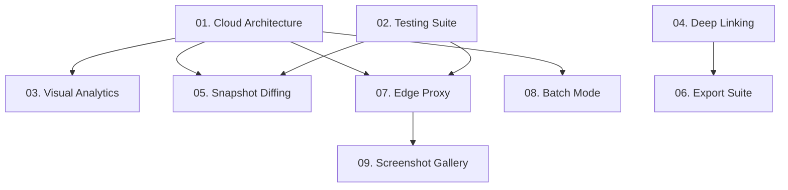

# 2026 Strategic Roadmap: TimeVault

**Vision:** To transform TimeVault from a "Wayback Machine Viewer" into the premier **Digital Forensics & History Platform**.

## Executive Summary

This roadmap outlines a 4-quarter strategy to professionalize the TimeVault codebase. We are moving beyond simple "search and view" to provide deep analytical tools, robust export capabilities, and a cloud-native architecture that supports user persistence.

Our focus is on three pillars:
1.  **Trust & Stability:** Moving from "prototype" to "production" with testing and type safety.
2.  **Insight:** replacing raw lists with visual analytics and diffing tools.
3.  **Data Sovereignty:** Giving users control over the data via exports and persistent history.

## Initiatives Overview

| # | Initiative | Category | Quarter | Size |
|---|------------|----------|---------|------|
| **00** | **Project Chronos (Moonshot)** | **AI / Archival** | **Future** | **XXL** |
| 01 | Cloud-Native State & Cache | Architecture | Q1 | L |
| 02 | The "Ironclad" Testing Suite | Testing | Q1 | M |
| 03 | "Time Travel" Visual Analytics | Feature | Q2 | L |
| 04 | Deep-Linkable Search State | DX / UX | Q2 | S |
| 05 | Intelligent Snapshot Diffing | Feature | Q3 | XL |
| 06 | "Data Liberation" Export Suite | Feature | Q3 | S |
| 07 | The "Instant" Edge Proxy | Performance | Q4 | M |
| 08 | Batch Forensics Mode | Feature | Q4 | L |
| 09 | Automated Screenshot Gallery | Visuals | Q4 | L |
| 10 | "Universal Access" Overhaul | Accessibility | Q4 | M |

## Dependency Graph

## Theme by Quarter

- **Q1: Foundation.** harden the backend, add persistence, and add tests.
- **Q2: Visualization.** Make the data beautiful and shareable.
- **Q3: Power Features.** Enable deep analysis (diffing) and export.
- **Q4: Scale & Polish.** Edge performance, bulk tools, and accessibility.
